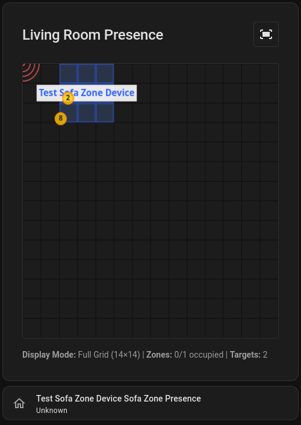

# Aqara FP2 ESPHome & Home Assistant Integration

> **⚠️ WARNING: EXPERIMENTAL SOFTWARE ⚠️**
> This project is in early development and **not well tested**. Use at your own risk!
> Features may be incomplete, unstable, or change without notice.
> Please report issues and contribute improvements if you encounter problems.

Custom ESPHome components and Home Assistant visualization card for the Aqara FP2 Presence Sensor.



See [FLASHING.md](FLASHING.md) for flashing instructions.

## Overview

This project provides two main components for working with the Aqara FP2 mmWave presence sensor:

1. **ESPHome Components** - Custom components for flashing and controlling the FP2 hardware directly with ESPHome
2. **Home Assistant Card** - Interactive visualization card for viewing real-time presence data, zones, and radar tracking

## Features

- Direct UART communication with FP2 radar sensor
- Real-time target tracking with position and velocity
- Customizable detection zones with individual sensitivity settings
- Interference grid and entry/exit zone configuration
- Visual representation of sensor coverage area
- Zone occupancy and motion detection
- Interactive web card with full/zoomed display modes

---

## Part 1: ESPHome Components

The ESPHome components allow you to flash custom firmware to the Aqara FP2 and integrate it directly with Home Assistant via the ESPHome API.

### Components

- **`aqara_fp2`** - Main component for FP2 radar sensor control and data collection
- **`aqara_fp2_accel`** - Accelerometer interface for mounting position detection

### Installation

For remote installation (once published):

```yaml
external_components:
  - source:
      type: git
      url: https://github.com/hansihe/esphome_fp2
      ref: main
    components: [aqara_fp2, aqara_fp2_accel]
```

### Configuration Example

See [example_config.yaml](example_config.yaml) for a complete working configuration.

### Grid Configuration

The FP2 uses a 14×14 grid to map the detection area:
- `.` = Active detection cell
- `X` = Zone coverage
- Grids available: `interference_grid`, `exit_grid`, `edge_label_grid`

### Flashing Instructions

See [FLASHING.md](FLASHING.md) for flashing instructions.

---

## Part 2: Home Assistant Card

An interactive visualization card for viewing FP2 sensor data in Home Assistant.

### Installation via HACS

This is the primary and recommended installation method.

1. **Add Custom Repository** (if not yet published to HACS default):
   - Open HACS in Home Assistant
   - Go to "Frontend"
   - Click the three dots (⋮) in the top right
   - Select "Custom repositories"
   - Add repository URL: `https://github.com/hansihe/esphome_fp2`
   - Category: `Dashboard`

2. **Install the Card**:
   - Search for "FP2" or "Aqara FP2 Presence Sensor Card"
   - Click "Download"
   - Restart Home Assistant

3. **Add to Dashboard**:
   ```yaml
   type: custom:aqara-fp2-card
   entity_prefix: sensor.fp2_living_room
   title: Living Room FP2
   display_mode: full  # Options: full, zoomed
   show_grid: true
   show_sensor_position: true
   show_zone_labels: true
   ```

### Card Features

- **Real-time target tracking**: Shows detected people/objects with position and velocity vectors
- **Zone visualization**: Color-coded zones showing occupancy status
- **Grid overlays**: Edge labels, interference sources, entry/exit zones
- **Display modes**:
  - Full view (entire 14×14 grid)
  - Zoomed view (active detection area only)
- **Interactive controls**: Click to toggle view modes
- **Sensor position marker**: Shows FP2 mounting location

### Card Configuration Options

| Option | Type | Default | Description |
|--------|------|---------|-------------|
| `entity_prefix` | string | **required** | Entity prefix (e.g., `sensor.fp2`) |
| `title` | string | "Aqara FP2 Presence Sensor" | Card title |
| `display_mode` | string | `full` | Display mode: `full` or `zoomed` |
| `show_grid` | boolean | `true` | Show grid lines |
| `show_sensor_position` | boolean | `true` | Show sensor position marker |
| `show_zone_labels` | boolean | `true` | Show zone names |
| `mounting_position` | string | from entity | Override mounting position |

---

## Project Structure

```
esphome_fp2/
├── components/
│   ├── aqara_fp2/           # Main FP2 component
│   │   ├── __init__.py
│   │   ├── fp2_component.cpp
│   │   ├── fp2_component.h
│   │   ├── binary_sensor.py
│   │   └── text_sensor.py
│   └── aqara_fp2_accel/     # Accelerometer component
│       ├── __init__.py
│       ├── aqara_fp2_accel.cpp
│       └── aqara_fp2_accel.h
├── card.js                   # Home Assistant visualization card
├── hacs.json                 # HACS integration metadata
├── example_config.yaml       # Example ESPHome configuration
└── README.md                 # This file
```

---

## Requirements

### ESPHome Components
- ESPHome 2024.x or later
- ESP32 (ESP32-SOLO-1 in stock FP2 hardware)
- ESP-IDF framework

### Home Assistant Card
- Home Assistant 2024.x or later
- HACS (recommended) or manual installation
- ESPHome integration configured with FP2 device

---

## Contributing

This is an experimental project and contributions are welcome!

Documentation around usage, improvements, or general feedback is welcome. I have made this mostly for myself, so I haven't put a massive amount of effort into making it easy to use.

See https://github.com/hansihe/AqaraPresenceSensorFP2ReverseEngineering for more technical details.

---

## Disclaimer

This project is not affiliated with or endorsed by Aqara. Use at your own risk. The authors are not responsible for any damage to your hardware or any issues arising from the use of this software.
